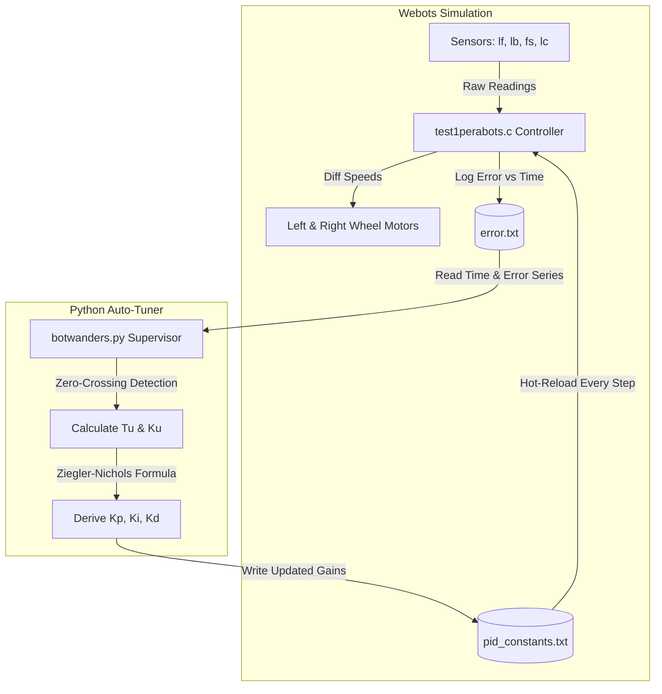

<div align="center">

<p align="center">
  
</p>

# 🤖 PeraBots 2025 — Team Robot Wanderers
### Autonomous Navigation & Intelligent Closed-Loop Wall-Following in Webots

[](https://cyberbotics.com/)
[](https://en.wikipedia.org/wiki/C_(programming_language))
[](https://www.python.org/)
[](https://en.wikipedia.org/wiki/Ziegler%E2%80%93Nichols_method)
[]()
[](https://eees.pdn.ac.lk/)
[]()

</div>

---

## 📌 Table of Contents

- [Overview](#overview)
- [Key Features](#key-features)
- [Simulation Showcase](#simulation-showcase)
- [Engineering Logbook](#engineering-logbook)
- [System Architecture & Robot Model](#system-architecture--robot-model)
- [Control Algorithms & Auto-Tuning](#control-algorithms--auto-tuning)
  - [1. Dual-Sensor Wall-Following Control](#1-dual-sensor-wall-following-control)
  - [2. Closed-Loop PID Control Formulation](#2-closed-loop-pid-control-formulation)
  - [3. Online Ziegler-Nichols Auto-Tuner](#3-online-ziegler-nichols-auto-tuner)
  - [4. Reactive Collision Avoidance & Corner Handling](#4-reactive-collision-avoidance--corner-handling)
- [Performance & Benchmark Analysis](#performance--benchmark-analysis)
- [Repository Structure](#repository-structure)
- [Prerequisites & Dependencies](#prerequisites--dependencies)
- [Getting Started & How to Run](#getting-started--how-to-run)
- [Current Tuned Constants](#current-tuned-constants)
- [Contributors & Team](#contributors--team)
- [Acknowledgments](#acknowledgments)

---

## 📖 Overview

Developed for the **PeraBots 2025** robotics competition, organized by the **Electrical and Electronic Engineering Society (EEES)** of the **University of Peradeniya**, Sri Lanka, this project presents an autonomous differential-drive robotic system designed by **Team Robot Wanderers**. Operating within the **Cyberbotics Webots** physics simulation environment, the robot autonomously explores complex arenas with curved and polygonal walled boundaries.

The core challenge revolves around maintaining high-speed, stable wall adherence across both **inner** and **outer wall contours** while rapidly recovering from abrupt corridor shifts, tight corners, and unforeseen obstacles without manual intervention.

To achieve this, our system pairs an ultra-low latency **C99 reactive robot controller** with an intelligent **Python-based Ziegler-Nichols oscillation analyzer** for real-time PID auto-tuning.

---

## ✨ Key Features

- 🏎️ **Precision Dual-Sensor Distance & Attitude Estimation**: Incorporates front-left (`lf`) and back-left (`lb`) distance sensors to continuously calculate both wall offset distance and angular deviation.
- 🔄 **Real-Time Dynamic PID Control**: Computes smooth differential steering velocity updates to eliminate steady-state error and counter drift.
- ⚡ **Zero-Crossing Frequency PID Auto-Tuner (`botwanders.py`)**: An external Python supervisory process that monitors error streams, detects zero-crossings, calculates the ultimate oscillation period ($T_u$), and calculates optimal $K_p$, $K_i$, and $K_d$ parameters via Ziegler-Nichols rules.
- 🔁 **Simulation Hot-Reloading**: The C controller reads updated PID parameters on-the-fly (`pid_constants.txt`) without needing to restart the simulation.
- 🛡️ **Autonomous Obstacle Detection & Collision Recovery**: Dedicated front sonar (`fs`) and corner distance sensor (`lc`) prevent head-on crashes into interior obstacles and navigate tight turns.
- 📊 **Inner vs. Outer Path Optimization**: Thoroughly tested across inner and outer perimeter tracks for performance validation.

---

## 🎥 Simulation Showcase

### Arena Traversal Simulation

The animated demonstration below highlights **Robot Wanderers** navigating the competition arena, handling sharp turns, and maintaining equidistant offset along irregular wall structures:

<p align="center">
  
</p>

> 💡 **Tip**: A complete video guide showing the auto-tuning workflow is available in the repository root: [`How to run AUTO TUNE.mp4`](How%20to%20run%20AUTO%20TUNE.mp4).

---

## 📑 Engineering Logbook

All engineering design workflows, mathematical derivations, parameter tuning logs, and milestone notes for **Team Robot Wanderers** throughout the PeraBots 2025 competition are comprehensively documented in our official logbook:

> 📄 **Official Logbook**: [**`PeraBots_2025_logbook.pdf`**](PeraBots_2025_logbook.pdf)

---

## 🛠️ System Architecture & Robot Model

The robot is modeled as a compact two-wheel differential drive platform with a caster support ring.

### Robot Specifications

| Specification | Value | Description |
| :--- | :--- | :--- |
| **Chassis Radius** | 37.0 mm (0.037 m) | Compact circular footprint |
| **Total Mass** | 0.15 kg | Center of mass balanced at $z = 0.015\text{ m}$ |
| **Wheel Radius** | 20.0 mm (0.02 m) | Left & right rotational drive |
| **Base Velocity** | 6.0 rad/s | Nominal forward speed |
| **Max Velocity** | 6.27 - 6.28 rad/s | Safe motor actuator ceiling |
| **Controller Timestep** | 32 ms | Control frequency $\approx 31.25\text{ Hz}$ |

### Sensor Suite Layout

| Device Tag | Sensor Type | Mounting Orientation | Primary Role |
| :---: | :---: | :---: | :--- |
| `lf` | Distance Sensor (Infrared) | Left-Front (75° / 1.309 rad) | Primary wall distance measurement |
| `lb` | Distance Sensor (Infrared) | Left-Back (75° / 1.309 rad) | Attitude / alignment angle estimation |
| `fs` | Sonar Distance Sensor | Front Center (0°) | Forward collision detection (< 10 cm) |
| `lc` | Distance Sensor (Infrared) | Left-Corner (75° / 1.31 rad) | Corner turn transition detection |

### Software Dataflow



---

## 🧠 Control Algorithms & Auto-Tuning

### 1. Dual-Sensor Wall-Following Control

Rather than relying on a single proximity distance, the robot computes an average distance $\bar{d}$ and an alignment error $\theta_{\text{align}}$ using both lateral sensors:

$$\bar{d} = \frac{d_{\text{lf}} + d_{\text{lb}}}{2}$$

$$\theta_{\text{align}} = |d_{\text{lb}} - d_{\text{lf}}|$$

The target wall spacing is defined by `INPUT_DISTANCE = 10.0 cm`. A region threshold `ERROR_DIST = 3.0 cm` categorizes the robot's spatial state:
- **Inside Deadband**: Minimal corrections required.
- **Outside Margin**: Active proportional steering to pull back towards the baseline.
- **Angular Misalignment**: When heading deviation $\theta_{\text{align}}$ exceeds `MAX_ALIGN_ANGLE` (threshold: 5.0 cm), heading realignment takes precedence.

---

### 2. Closed-Loop PID Control Formulation

The continuous tracking error is given by:

$$e(t) = \bar{d}(t) - d_{\text{target}}$$

At each discrete timestep $\Delta t = 0.032\text{ s}$:

- **Integral Term**: $I(t) = I(t - 1) + e(t) \cdot \Delta t$
- **Derivative Term**: $\displaystyle D(t) = \frac{e(t) - e(t - 1)}{\Delta t}$
- **Total Control Output**: $u(t) = K_p \cdot e(t) + K_i \cdot I(t) + K_d \cdot D(t)$

The steering output $u(t)$ alters the differential velocities:

$$v_{\text{left}} = V_{\text{base}} - u(t)$$

$$v_{\text{right}} = V_{\text{base}} + u(t)$$

Differential limits are clamped ($|v_{\text{left}} - v_{\text{right}}| \le 6.0\text{ rad/s}$, via `MAX_DIFFERENCE`) to prevent spinning out or wheel slip.

---

### 3. Online Ziegler-Nichols Auto-Tuner

The script [`controllers/test1perabots/botwanders.py`](controllers/test1perabots/botwanders.py) automates the tuning of control parameters using continuous oscillation analysis:

1. **Error Stream Sampling**: Webots streams timestamped errors to `error.txt`.
2. **Sub-Sample Zero-Crossing Interpolation**: When consecutive error samples change sign ($e_{k-1} \cdot e_k < 0$), the precise zero-crossing timestamp $t^{\ast}$ is computed:
   $\displaystyle t^{\ast} = t_{k-1} + (0 - e_{k-1}) \cdot \frac{t_k - t_{k-1}}{e_k - e_{k-1}}$
3. **Ultimate Period ($T_u$) Extraction**: From $N$ consecutive zero-crossing intervals, the ultimate oscillation period is calculated:
   $\displaystyle T_u = \frac{1}{N} \sum_{i=1}^{N} (t^{\ast}_{i+2} - t^{\ast}_i)$
4. **Ziegler-Nichols Gain Estimation**: With ultimate gain $K_u$, the optimal PID parameters are calculated:
   $K_p = 0.6 \cdot K_u, \quad \displaystyle K_i = \frac{1.2 \cdot K_u}{T_u}, \quad K_d = 0.075 \cdot K_u \cdot T_u$
5. **Hot-Reload Dispatch**: Updated constants are written into `pid_constants.txt` and immediately integrated by the active simulation.

---

### 4. Reactive Collision Avoidance & Corner Handling

- **Front Obstacle Intervention**: If the front sonar reading drops below `COLLISION_DISTANCE` (10.0 cm), the controller overrides PID guidance and executes an evasive turn away from the obstacle.
- **Corner Transition Detection**: The left-corner sensor (`lc`) distinguishes between smooth straight walls, outer turns, and pocket recesses, preventing false wall-tracking lockups.

---

## 📈 Performance & Benchmark Analysis

The robot's tracking accuracy and path fidelity were evaluated across both **Outer Wall** and **Inner Wall** courses. The comparative tracking and deviation behavior is illustrated below:

<p align="center">
  
</p>

### Performance Highlights:
- **Outer Wall Tracking**: Features smoother curvatures and gradual bends, exhibiting minimal oscillation amplitude and fast convergence to the 10 cm setpoint.
- **Inner Wall Tracking**: Introduces sharper radii and acute obstacle contours. The combination of angle-alignment checks and derivative damping ($K_d$) maintains stability without boundary collisions.
- **Dynamic Stability**: Settling time under step disturbances remains within 1.5 s.

---

## 📁 Repository Structure

```text
PeraBots-2025-Team-Robot-Wanderers/
├── .git/                                # Git version control metadata
├── How to run AUTO TUNE.mp4             # Video walkthrough for running auto-tuning
├── How to run.txt                       # Quick reference notes
├── PeraBots_2025_logbook.pdf            # 📑 Official PeraBots 2025 Engineering Logbook
├── README.md                            # Comprehensive project documentation
├── Robot Wanderers.gif                  # Recorded Webots simulation animation
├── controllers/
│   └── test1perabots/                   # Robot controller directory
│       ├── Makefile                     # Webots build configuration
│       ├── botwanders.py                # Python Ziegler-Nichols auto-tuner
│       ├── test1perabots.c              # Primary C robot controller source
│       ├── test1perabots.exe            # Compiled controller binary
│       ├── pid_constants.txt            # Live PID constants (hot-reloaded)
│       └── error.txt                    # Simulation error logging output
├── images/
│   ├── Outer wall and inner wall performance.png  # Performance comparison plot
│   └── Robot Wanderers logo.png         # Official Team Robot Wanderers logo
├── libraries/                           # Custom simulation libraries
├── path/
│   ├── inner_path.obj                   # 3D inner obstacle/wall mesh
│   └── outer_path.obj                   # 3D outer boundary wall mesh
├── plugins/                             # Webots simulation plugins
│   ├── physics/                         # Physics simulation plugin routines
│   ├── remote_controls/                 # Remote control interfacing
│   └── robot_windows/                   # Custom robot window interfaces
├── protos/
│   └── Robot.urdf                       # Complete URDF robot model definition
└── worlds/
    ├── pera bots.wbt                    # Competition Webots simulation world
    ├── .pera bots.wbproj                # Webots project configuration
    └── .pera bots.jpg                   # World preview thumbnail
```

### 🔍 Key File Descriptions

| File / Directory | Description |
| :--- | :--- |
| **[`PeraBots_2025_logbook.pdf`](PeraBots_2025_logbook.pdf)** | **Official Team Engineering Logbook** containing detailed documentation of project objectives, hardware modeling, sensor setups, mathematical derivations, test iterations, and meeting minutes. |
| **[`Robot Wanderers.gif`](Robot%20Wanderers.gif)** | High-resolution simulation animation displaying real-time wall tracking and collision avoidance in Webots. |
| **[`How to run AUTO TUNE.mp4`](How%20to%20run%20AUTO%20TUNE.mp4)** | Visual video walkthrough demonstrating how to launch and observe the automated PID tuning pipeline. |
| **[`controllers/test1perabots/test1perabots.c`](controllers/test1perabots/test1perabots.c)** | High-frequency ($\approx 31.25\text{ Hz}$) reactive C controller performing distance sensing, region checks, and dynamic motor velocity dispatch. |
| **[`controllers/test1perabots/botwanders.py`](controllers/test1perabots/botwanders.py)** | Real-time Python supervisor implementing continuous zero-crossing frequency detection and Ziegler-Nichols parameter generation. |
| **[`worlds/pera bots.wbt`](worlds/pera%20bots.wbt)** | Primary Webots simulation environment featuring custom arena boundaries and obstacles modeled after the PeraBots 2025 track. |
| **[`images/`](images/)** | Contains the team logo and the inner vs. outer wall performance benchmarking charts. |

---

## 📦 Prerequisites & Dependencies

Before running the simulation or auto-tuner, ensure you have the following installed:

1. **Webots Robot Simulator**:
   - [Cyberbotics Webots](https://cyberbotics.com/) (Version **R2025a** or **R2023b**)
2. **Python Environment** (for Auto-Tuning):
   - Python 3.8+
   - `numpy`
   ```bash
   pip install numpy
   ```
3. **C Compiler** *(Optional, if modifying C controller)*:
   - GCC / MinGW bundled with Webots or installed locally.

---

## 🚀 Getting Started & How to Run

### Method 1: Standard Simulation Run (Direct Webots)

1. Launch **Cyberbotics Webots**.
2. Open the world file:
   - Navigate to `File` > `Open World...`
   - Select `worlds/pera bots.wbt`
3. Click the **Play** button (▶️) on the top toolbar to start the simulation.
4. The robot will start navigating and tracking walls using the pre-tuned PID constants from `pid_constants.txt`.

---

### Method 2: Automated Run with PID Auto-Tuning

To execute the self-tuning pipeline with real-time parameter optimization:

1. Verify that your Webots installation path matches your system configuration in [`controllers/test1perabots/botwanders.py`](controllers/test1perabots/botwanders.py#L20) (default: `C:\Program Files\Webots\msys64\mingw64\bin\webots.exe`).
2. Run the tuning supervisor script:
   ```bash
   cd controllers/test1perabots
   python botwanders.py
   ```
3. The script will:
   - Clear existing logs (`error.txt`, `pid_constants.txt`).
   - Launch Webots with `worlds/pera bots.wbt`.
   - Monitor real-time trajectory errors.
   - Detect zero crossings and compute $T_u$.
   - Continuously update `pid_constants.txt`.

> 🎥 **Video Tutorial**: Refer to [`How to run AUTO TUNE.mp4`](How%20to%20run%20AUTO%20TUNE.mp4) for a visual step-by-step demonstration.

---

### Method 3: Compiling Controller from Source (C)

If you modify [`test1perabots.c`](controllers/test1perabots/test1perabots.c):
1. Open the file in Webots' built-in code editor or an external terminal.
2. Build the controller using the provided `Makefile`:
   ```bash
   cd controllers/test1perabots
   make clean
   make
   ```

---

## 🎯 Current Tuned Constants

The best-performing parameters obtained from our Ziegler-Nichols tuning runs and manual boundary calibration:

| Parameter | Symbol | Current Value | Functional Role |
| :--- | :---: | :---: | :--- |
| **Proportional Gain** | $K_p$ | `0.3000` | Drives rapid response to wall distance offsets |
| **Integral Gain** | $K_i$ | `0.2285` | Eliminates residual steady-state offset on curved walls |
| **Derivative Gain** | $K_d$ | `0.0984` | Damps overshoots and smooths aggressive corrections |
| **Ultimate Gain** | $K_u$ | `0.5000` | Baseline critical oscillation gain |
| **Input Distance** | $d_{\text{target}}$ | `10.0 cm` | Target distance from the wall |

---

## 👥 Contributors & Team

We are **Team Robot Wanderers**, representing the Faculty of Engineering, University of Peradeniya at **PeraBots 2025**.

<div align="center">

<table align="center" style="border: none; border-collapse: collapse;">
  <tr align="center" style="border: none;">
    <td align="center" width="25%" style="border: none; padding: 15px;">
      <a href="https://people.ce.pdn.ac.lk/students/e22/130/">
        
      </a>
      <br />
      <b>Sanindu Hansara</b><br />
      <sub>University of Peradeniya</sub>
    </td>
    <td align="center" width="25%" style="border: none; padding: 15px;">
      <a href="https://people.ce.pdn.ac.lk/students/e22/008/">
        
      </a>
      <br />
      <b>Thisum Abeywickrama</b><br />
      <sub>University of Peradeniya</sub>
    </td>
    <td align="center" width="25%" style="border: none; padding: 15px;">
      <a href="https://github.com/piyuminipunika">
        
      </a>
      <br />
      <b>Piyumi Nipunika</b><br />
      <sub>University of Peradeniya</sub>
    </td>
    <td align="center" width="25%" style="border: none; padding: 15px;">
      
      <br />
      <b>Tharani Pathirana</b><br />
      <sub>University of Peradeniya</sub>
    </td>
  </tr>
</table>

</div>

---

## 🙏 Acknowledgments

- **Electrical and Electronic Engineering Society (EEES)**, University of Peradeniya — for organizing the **PeraBots 2025** competition and fostering student innovation in autonomous robotics.
- **Department of Electrical & Electronic Engineering** and **Faculty of Engineering, University of Peradeniya** — for continuous academic support and facilities.
- **Cyberbotics Webots Community** — for developing and maintaining the open-source Webots robot simulator.

---

<div align="center">
  <sub>Built with ❤️ by <strong>Team Robot Wanderers</strong> for <strong>PeraBots 2025</strong></sub>
</div>
